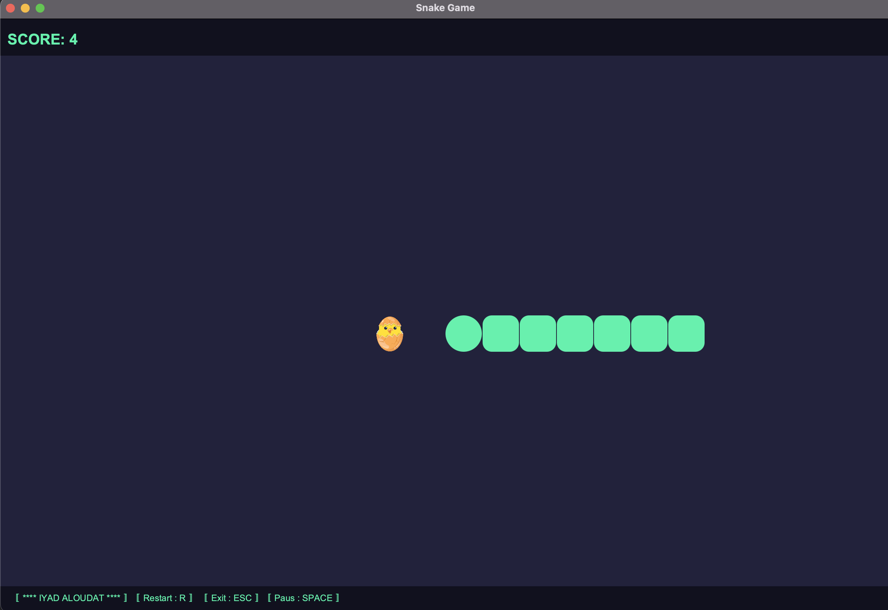
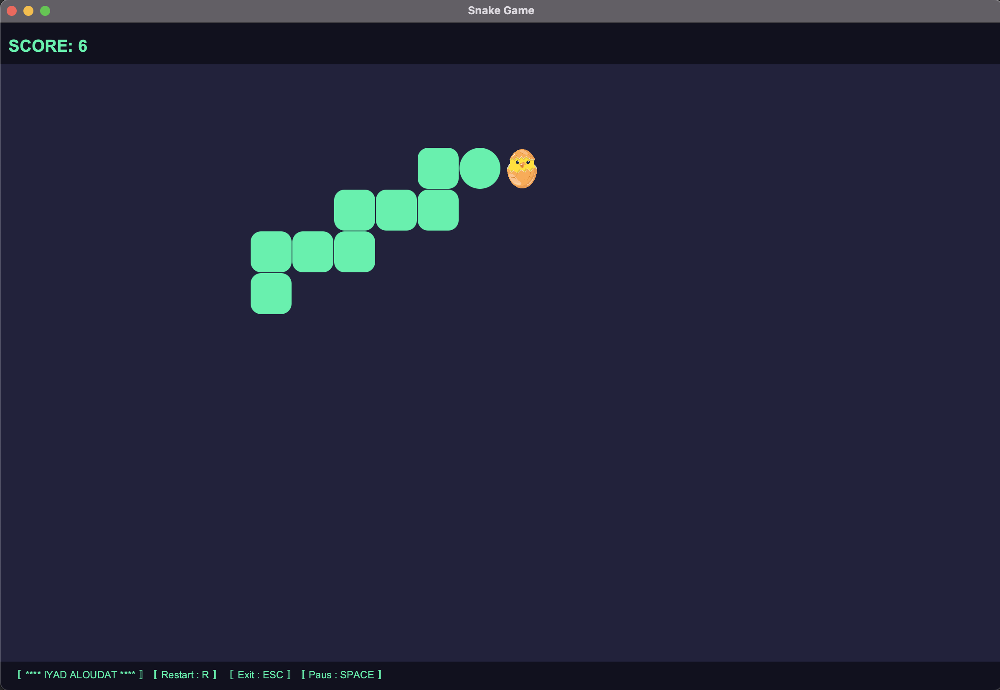
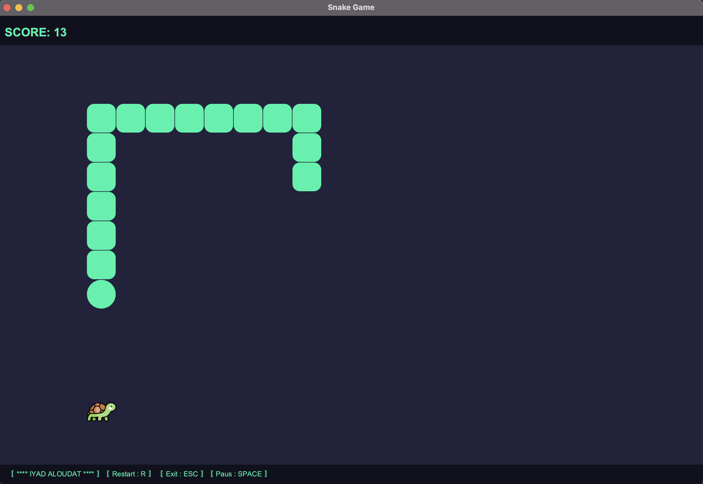
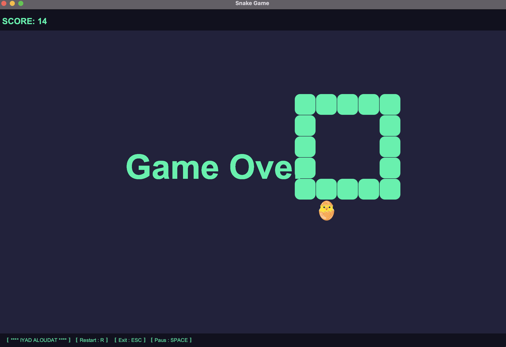

# Snake Game - JAVA FX

This code represents a simplified version of the Snake game developed using JavaFX.
The game is played on a canvas and consists of a snake and food. 
The objective of the game is to collect as much food as possible without colliding with the snake's own body.

The game contains the following methods:

> setUp(Stage primaryStage):

creates the game window and adds a canvas to it.

> setUpGame(): 

initializes the game state by creating the snake and generating the first food.

> setUpGameLoop(): 

starts the game loop which updates the state of the game, moves the snake, and checks for collisions.

> setUpKeyHandler(): 

sets up the key handler to handle user input.

> handleKeyEvent(KeyCode code): 

handles user input and sets the snake's direction accordingly.

> restart(): 

restarts the game if the user presses the R key after game over.

> pause(): 

pauses the game if the user presses the space bar.

> resume(): 

resumes the game if the user presses the space bar again.

> updateDirectionIfNotOpposite(int newDirection, int oppositeDirection): 

updates the snake's direction if it is not the opposite of the current direction.

> setDirection(KeyCode code): 

sets the snake's direction based on the user input.

> drawBackground(GraphicsContext gc): 

draws the game background.

> drawSnake(GraphicsContext gc): 

draws the snake on the canvas.

> drawFood(GraphicsContext gc): 

draws the food on the canvas.

> generateFood(): 

generates a new random food location.

> eatFood(): 

checks if the snake has eaten the food and updates the game state accordingly.

> moveSnake(): 

moves the snake by updating the x and y coordinates of each body part.

> checkCollision(): 

checks if the snake has collided with the walls or its own body.

> The game is initialized by calling the setUp(Stage primaryStage) method, 

which creates the game window and sets up the canvas. 

> The setUpGame() method 

is called to initialize the game state, which creates the snake and generates the first food. 

> The setUpGameLoop() method 

starts the game loop, which updates the state of the game, moves the snake, and checks for collisions.

> The handleKeyEvent(KeyCode code) method 

is called when the user presses a key, and it sets the snake's direction based on the user input. 

> The restart(), pause(), and resume() methods 

handle game over and pause functionality.

The moveSnake() method 
> moves the snake by updating the x and y coordinates of each body part. 

The checkCollision() method 
> checks if the snake has collided with the walls or its own body. 

The eatFood() method 
> checks if the snake has eaten the food and updates the game state accordingly.

Finally, the game is drawn on the canvas using the drawBackground(GraphicsContext gc), drawSnake(GraphicsContext gc), and drawFood(GraphicsContext gc) methods.

